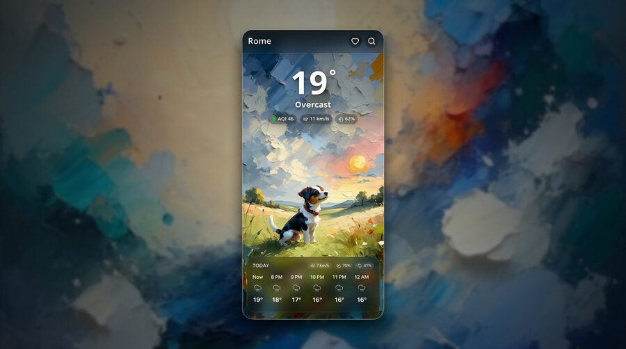

<div align="center">
  <h1>JackCast</h1>
  <p><em>A playful, relaxing weather companion that paints the forecast with personality.</em></p>
  <p>
    
    
    
    
    
  </p>
</div>

---

## What is JackCast?

JackCast is a **Progressive Web App** that reimagines the weather forecast as a cozy, visually immersive experience. Instead of sterile icons and plain numbers, every forecast is wrapped in a **hand-crafted, AI-generated painterly scene** starring a spirited Jack Russell Terrier reacting to the weather around them.

Whether it's a golden sunrise over rolling hills, a cozy snowfall under moonlight, or a playful dash through autumn rain, the background art shifts dynamically to match your local conditions and time of day. The result feels less like a utility and more like a little window into a living storybook.

<div align="center">
  
</div>

## Features

- **Dynamic AI Art Backgrounds** — Every weather condition and time of day (morning, afternoon, evening, night) is paired with a unique theme-specific illustration generated via the Venice.ai API. The art cycles daily so the view never gets stale.
- **Real-Time Weather Data** — Powered by the free [Open-Meteo](https://open-meteo.com/) API. No API keys needed for weather data.
- **Geolocation & Search** — Automatically detects your location, or search for any city worldwide.
- **Favorites** — Save your go-to locations for quick access.
- **Hourly & 7-Day Forecasts** — Scrollable hourly breakdown plus a clean daily outlook.
- **Air Quality Index** — Real-time AQI display right alongside the temperature.
- **PWA Ready** — Install JackCast to your home screen. Works offline with a service worker and responsive, mobile-first design.
- **Smooth Animations** — Polished transitions and micro-interactions powered by [Motion](https://motion.dev/).

## The Art Pipeline

The art pipeline in `scripts/cover-generator/` fills every configured theme in one pass:

1. **Combines 5 weather categories** (`clear`, `cloudy`, `rain`, `snow`, `storm`) with 4 times of day.
2. **Generates 4 variations** per category/time combination for each theme, saving to `public/backgrounds/<theme>/`.
3. **Uses theme-specific prompt blocks** in `config.json` for subject, visual language, composition, and weather scenes.
4. **Requires abstract illustration** in every prompt and explicitly excludes photography, realistic subjects, 3D, devices, logos, and text.
5. **Fills only missing slots** and updates `src/config/background-assets.ts` so newly generated covers are selectable by the app.

Run the generator with:

```bash
cd scripts/cover-generator
# Ensure VENICE_API_KEY is set in your environment
pnpm install
pnpm generate -- --dry-run                # review the all-theme plan and prompts
pnpm generate -- --limit 10               # generate at most 10 API attempts
pnpm generate -- --theme samurai-zen      # generate one theme only
pnpm generate -- --theme arcade-fighter   # generate Arcade Fighter covers
pnpm generate -- --check                  # validate config and asset inventory

```

## Tech Stack

| Layer | Technology |
|-------|------------|
| Framework | React 19 + TypeScript |
| Build Tool | Vite 6 |
| Styling | Tailwind CSS 4 |
| Animations | Motion (Framer Motion) |
| Icons | Lucide React |
| Weather API | Open-Meteo |
| Image Generation | Venice.ai API |
| Deployment | Cloudflare Workers (Wrangler) |

## Getting Started

### Prerequisites

- [Node.js](https://nodejs.org/) (v20 or later recommended)
- [pnpm](https://pnpm.io/) (preferred package manager)

### Installation

```bash
# Install dependencies
pnpm install

# Start the dev server
pnpm dev
```

The app will be available at `http://localhost:3000`.

### Building for Production

```bash
pnpm build
```

### Deploying

```bash
pnpm deploy
```

This builds the project and deploys it to Cloudflare Workers using Wrangler.

## Project Structure

```
jackcast/
├── public/
│   ├── backgrounds/          # Theme-specific weather art sets
│   │   ├── jack-russell/     # Generated watercolor covers
│   │   ├── samurai-zen/      # Samurai/Zen covers and fallback
│   │   ├── nothing-os/       # Nothing OS-inspired covers and fallback
│   │   ├── arcade-fighter/   # Arcade fighting-game covers and fallback
│   │   ├── pocket-clay/      # Handcrafted miniature-world covers and fallback
│   │   └── nordic-paper/     # Layered paper landscape covers and fallback
│   ├── manifest.json         # PWA manifest
│   └── sw.js                 # Service worker
├── scripts/
│   └── cover-generator/      # AI art generation pipeline
│       ├── config.json       # Prompt templates & weather mappings
│       └── generate.js       # Venice.ai image generation script
├── src/
│   ├── components/           # React UI components
│   ├── config/
│   │   ├── backgrounds.ts    # Background asset resolution logic
│   │   └── themes.ts         # Theme registry and metadata
│   ├── services/
│   │   └── weather.ts        # Open-Meteo API client
│   ├── App.tsx               # Main application shell
│   └── types.ts              # Shared TypeScript types
├── package.json
├── vite.config.ts
└── wrangler.jsonc            # Cloudflare Workers config
```

## Design Philosophy

JackCast was built on a simple idea: **weather apps don't have to be boring**. Most forecasts present data as efficiently as possible, but efficiency isn't the only metric that matters. By wrapping forecasts in generative art that reacts to real conditions, JackCast turns a daily habit into a small moment of delight.

The Jack Russell Terrier was chosen as the mascot because the breed embodies the app's spirit — energetic, curious, and ready for any weather.

## License

This project is open source. Feel free to fork, remix, and make it your own.

---

<div align="center">
  <p><sub>Built with curiosity, caffeine, and a very good dog.</sub></p>
</div>
